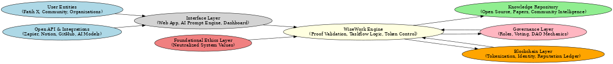
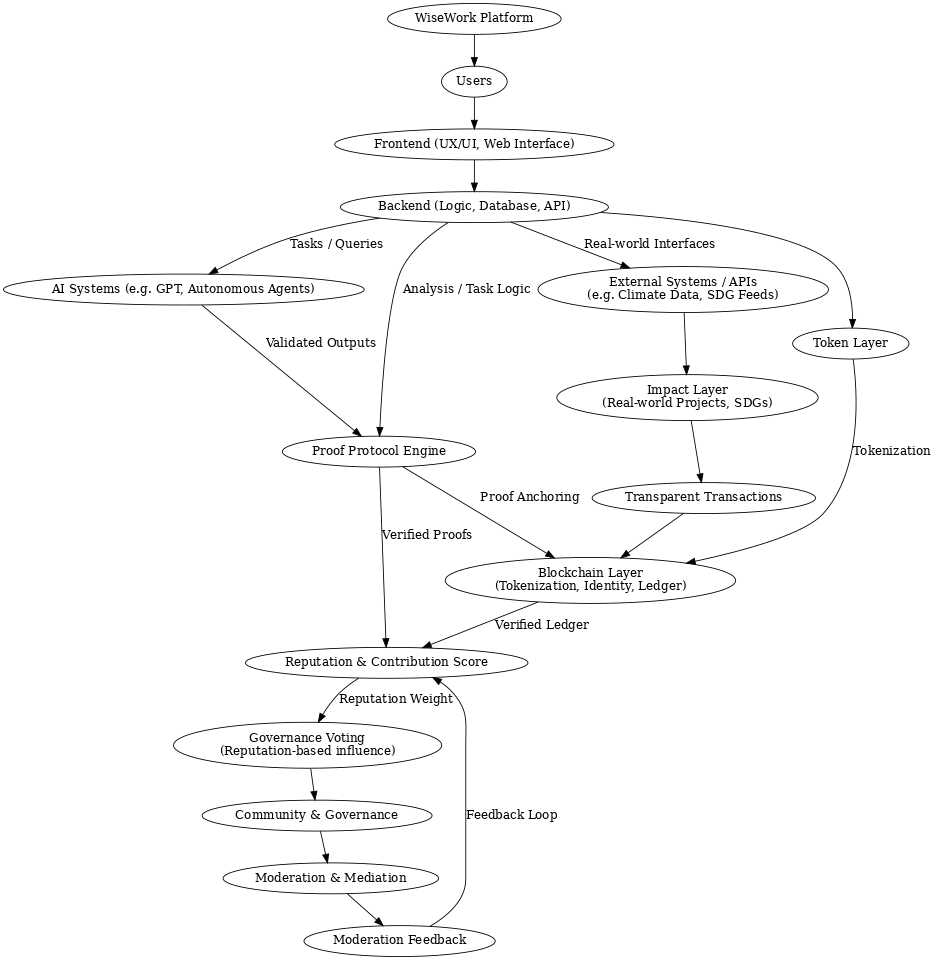

# 🧠 System Architecture of WiseWork

## 🔷 High-Level System Overview

This diagram presents the functional structure of the WiseWork protocol, including:

- User Interfaces, Integration Layer, Neutralized Governance Ethics
- Core Engine for Proof Validation, Taskflows, Token Logic
- Backend Layers for Blockchain, Identity, and Knowledge Integration

---

## 🔬 Detailed Flow of Validation & Impact

This diagram illustrates the systemic flow of user interactions, AI task generation, contribution validation, moderation, token anchoring, and reputation dynamics.

It bridges the frontend experience with real-world outcomes and transparent tokenized processes.

