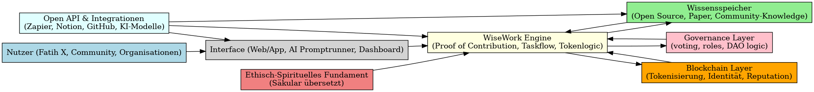
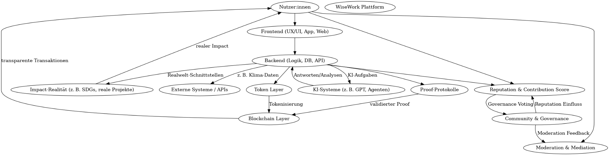

# 🧠 System Architecture of WiseWork

## 🔷 High-Level System Diagram

This diagram presents the core structure of the WiseWork protocol:

- **User Layer**: Individual contributions, roles, and reputation
- **Function Layer**: Tasks, knowledge modules, and challenges
- **Coordination Layer**: Proof logic, tokenomics, and governance
- **Infrastructure Layer**: Blockchain, AI, data flows, and external APIs

---

## 🔬 Detailed Impact & Flow Map

This system flow illustrates:

- Validation processes across proof modules
- Feedback loops between human and machine input
- Reputation and token feedback for real-world aligned incentives
- Transparent contribution tracking for decentralized decision-making
